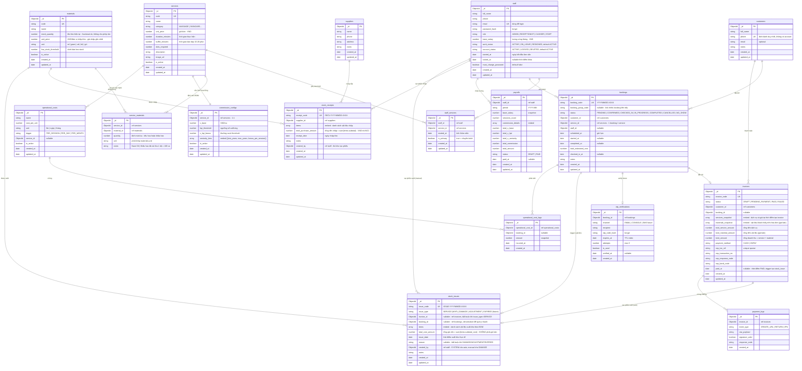

**Phiên bản:** v7 (sửa các trạng thái staff theo mô tả của user story)  

```mermaid
erDiagram
 
  customers {
    ObjectId _id          PK
    string   full_name
    string   phone        UK "định danh duy nhất, không có account"
    string   email        "optional"
    string   notes
    date     created_at
    date     updated_at
  }
 
  staff {
    ObjectId _id           PK
    string   full_name
    string   phone
    string   email         UK "dùng để login"
    string   password_hash "bcrypt"
    string   role          "ADMIN | RECEPTIONIST | CASHIER | STAFF"
    number   base_salary   "lương cứng tháng - VND"
    string   work_status    "ACTIVE | ON_LEAVE | RESIGNED, default ACTIVE"
    string   account_status "ACTIVE | LOCKED | DELETED, default ACTIVE"
    date     started_at     "ngày bắt đầu làm việc"
    date     locked_at      "nullable thời điểm khóa"
    boolean  must_change_password "default false"
    date     created_at
    date     updated_at
  }
 
  services {
    ObjectId _id              PK
    string   code             UK
    string   name
    string   category         "MASSAGE | SKINCARE..."
    number   unit_price       "giá bán - VND"
    number   duration_minutes "thời gian thực hiện"
    number   buffer_minutes   "thời gian dọn dẹp 10-20 phút"
    number   slots_required
    string   description
    string   image_url
    boolean  is_active
    date     created_at
    date     updated_at
  }
 
  materials {
    ObjectId _id                 PK
    string   code                UK
    string   name
    number   stock_quantity      "tồn kho hiện tại - fractional ok, không cho phép âm"
    number   unit_price          "VND/đơn vị nhập kho - giá nhập gần nhất"
    string   unit                "ml | gram | cái | bộ | gói"
    number   low_stock_threshold "cảnh báo low stock"
    boolean  is_active
    date     created_at
    date     updated_at
  }
 
  suppliers {
    ObjectId _id        PK
    string   name
    string   phone
    string   address
    string   notes
    date     created_at
    date     updated_at
  }
 
  service_materials {
    ObjectId _id         PK
    ObjectId service_id  "ref services"
    ObjectId material_id "ref materials"
    number   quantity    "định mức/ca - tiêu hao hoặc khấu hao"
    string   unit        "phải khớp materials.unit"
    string   notes       "Base Oil | Khấu hao đá núi lửa 1 bộ = 100 ca"
  }
 
  commission_configs {
    ObjectId _id             PK
    ObjectId service_id      "ref services - 1-1"
    number   c_base          "VND/ca"
    number   kpi_threshold   "ngưỡng số ca/tháng"
    number   c_kpi_bonus     "thưởng vượt threshold"
    array    seniority_tiers "embed [{min_years, max_years, bonus_per_session}]"
    boolean  is_active
    date     created_at
    date     updated_at
  }
 
  staff_services {
    ObjectId _id         PK
    ObjectId staff_id    "ref staff"
    ObjectId service_id  "ref services"
    date     started_at  "tính thâm niên"
    boolean  is_primary  "true = chuyên trách"
    date     created_at
    date     updated_at
  }
 
  bookings {
    ObjectId _id                  PK
    string   booking_code         UK "YYYYMMDD-XXXX"
    string   booking_group_code   "nullable - link nhiều booking liên tiếp"
    string   status               "PENDING | CONFIRMED | CHECKED_IN | IN_PROGRESS | COMPLETED | CANCELLED | NO_SHOW"
    ObjectId customer_id          "ref customers"
    ObjectId service_id           "ref services - 1 booking 1 service"
    ObjectId staff_id             "nullable"
    date     scheduled_at         "giờ hẹn"
    date     started_at           "nullable"
    date     completed_at         "nullable"
    number   total_estimated_cost
    date     checked_in_at        "nullable"
    string   notes
    date     created_at
    date     updated_at
  }
 
  otp_verifications {
    ObjectId _id           PK
    ObjectId booking_id    "ref bookings"
    string   channel       "EMAIL | CONSOLE | SMS future"
    string   recipient
    string   otp_code_hash "bcrypt"
    date     expires_at    "TTL index"
    number   attempts      "max 3"
    boolean  is_used
    date     verified_at   "nullable"
    date     created_at
  }
 
  invoices {
    ObjectId _id                   PK
    string   invoice_code          UK
    string   status                "DRAFT | PENDING_PAYMENT | PAID | FAILED"
    ObjectId customer_id           "ref customers"
    ObjectId booking_id            "nullable"
    array    services_snapshot     "embed - dịch vụ và giá tại thời điểm tạo invoice"
    array    materials_snapshot    "embed - vật liệu khách thấy trên hóa đơn (giá bán)"
    number   total_service_amount  "tổng tiền dịch vụ"
    number   total_material_amount "tổng tiền vật liệu (giá bán)"
    number   total_amount          "tổng doanh thu = service + material"
    string   payment_method        "CASH | VNPAY"
    string   vnp_txn_ref           "unique sparse"
    string   vnp_transaction_no
    string   vnp_response_code
    string   vnp_bank_code
    date     paid_at               "nullable - thời điểm PAID, trigger tạo stock_issue"
    date     created_at
    date     updated_at
  }
 
  payment_logs {
    ObjectId _id             PK
    ObjectId invoice_id      "ref invoices"
    string   event_type      "CREATE_URL | RETURN | IPN"
    string   raw_payload
    boolean  signature_valid
    string   response_code
    date     created_at
  }
 
  stock_receipts {
    ObjectId _id                   PK
    string   receipt_code          UK "RECV-YYYYMMDD-XXXX"
    ObjectId supplier_id           "ref suppliers"
    array    items                 "embed - danh sách vật liệu nhập"
    number   total_purchase_amount "tổng tiền nhập = sum(items.subtotal) - VND trả NCC"
    date     receipt_date          "ngày nhập kho"
    string   notes
    ObjectId created_by            "ref staff - thủ kho tạo phiếu"
    date     created_at
    date     updated_at
  }
 
  stock_issues {
    ObjectId _id               PK
    string   issue_code        UK "ISSUE-YYYYMMDD-XXXX"
    string   issue_type        "SERVICE (MVP) | DAMAGE | ADJUSTMENT | EXPIRED (future)"
    ObjectId invoice_id        "nullable - ref invoices, bắt buộc khi issue_type=SERVICE"
    ObjectId booking_id        "nullable - ref bookings, denormalize để query nhanh"
    array    items             "embed - danh sách vật liệu xuất kho theo BOM"
    number   total_cost_amount "tổng giá vốn = sum(items.subtotal_cost) - KHÔNG phải giá bán"
    date     issue_date        "thời điểm xuất kho thực tế"
    string   reason            "nullable - bắt buộc khi DAMAGE/ADJUSTMENT/EXPIRED"
    ObjectId created_by        "ref staff - SYSTEM cho auto, manual cho DAMAGE"
    string   notes
    date     created_at
    date     updated_at
  }
 
  payrolls {
    ObjectId _id                PK
    ObjectId staff_id           "ref staff"
    string   period             "YYYY-MM"
    number   base_salary        "snapshot"
    number   sessions_count
    array    commission_details "embed"
    number   total_c_base
    number   total_c_kpi
    number   total_c_seniority
    number   total_commission
    number   total_amount
    string   status             "DRAFT | PAID"
    date     paid_at            "nullable"
    date     created_at
    date     updated_at
  }
 
  operational_costs {
    ObjectId _id           PK
    string   name
    number   cost_per_unit
    string   unit          "lần | ngày | tháng"
    string   trigger       "PER_SESSION | PER_DAY | PER_MONTH"
    ObjectId service_id    "nullable"
    boolean  is_active
    date     created_at
    date     updated_at
  }
 
  operational_cost_logs {
    ObjectId _id                  PK
    ObjectId operational_cost_id  "ref operational_costs"
    ObjectId booking_id           "nullable"
    number   amount               "snapshot"
    date     incurred_at
    date     created_at
  }
 
  customers      ||--o{ bookings              : "đặt lịch"
  customers      ||--o{ invoices              : "thanh toán"
  bookings       ||--o| invoices              : "dẫn tới"
  bookings       ||--o| otp_verifications     : "verify future"
  bookings       ||--o| stock_issues          : "trigger xuất kho"
  bookings       ||--o{ operational_cost_logs : "phát sinh"
  staff          ||--o{ staff_services        : "chuyên trách"
  services       ||--o{ staff_services        : "phụ trách bởi"
  services       ||--|{ service_materials     : "định mức BOM"
  materials      ||--o{ service_materials     : "dùng trong"
  services       ||--|| commission_configs    : "cấu hình hoa hồng"
  services       ||--o{ operational_costs     : "chi phí vận hành"
  staff          ||--o{ bookings              : "phụ trách"
  staff          ||--o{ payrolls              : "nhận lương"
  staff          ||--o{ stock_receipts        : "tạo phiếu nhập"
  staff          ||--o{ stock_issues          : "tạo phiếu xuất (manual)"
  suppliers      ||--o{ stock_receipts        : "cung cấp"
  invoices       ||--o| stock_issues          : "tạo phiếu xuất (auto)"
  invoices       ||--o{ payment_logs          : "có log VNPay"
  materials      ||--o{ stock_receipts        : "được nhập"
  materials      ||--o{ stock_issues          : "được xuất"
  operational_costs ||--o{ operational_cost_logs : "có log"
```
 